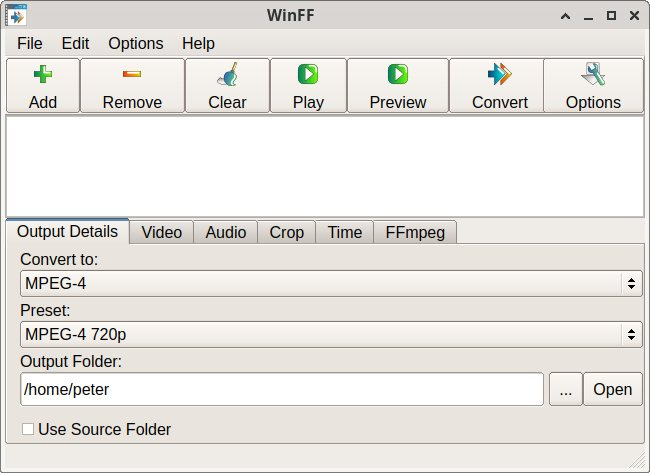

# WinFF

WinFF is a GUI for the command line video converter [FFmpeg](https://ffmpeg.org).

## Instalation

Download instalation files for multiple platforms [here](https://www.biggmatt.com/p/winff.html).

On Windows you can use [chocolatey](https://chocolatey.org/packages/winff): `choco install winff`

## License

WinFF is published under the GNU Public License v3 without any warranty implied or otherwise, with no suitability for any purpose. Use this software at your own risk.
